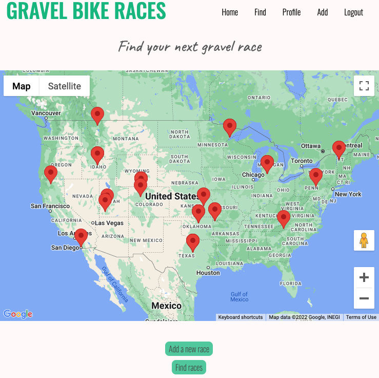
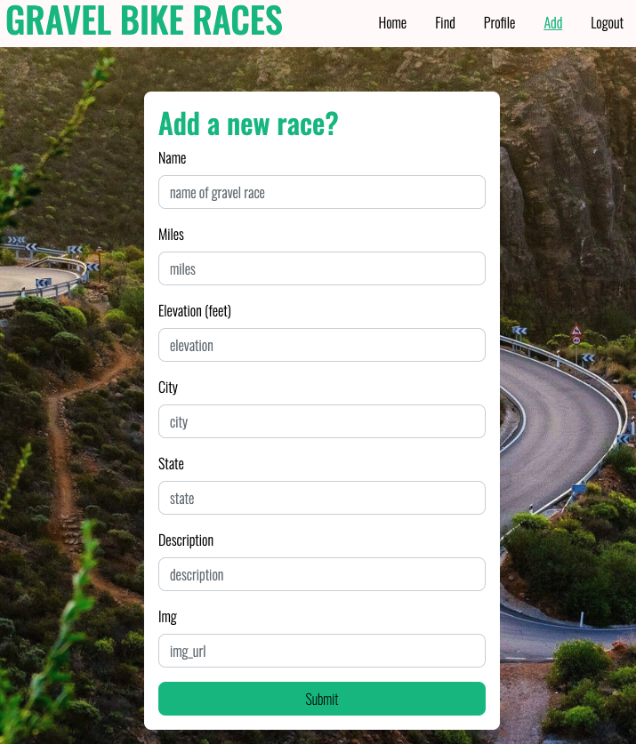
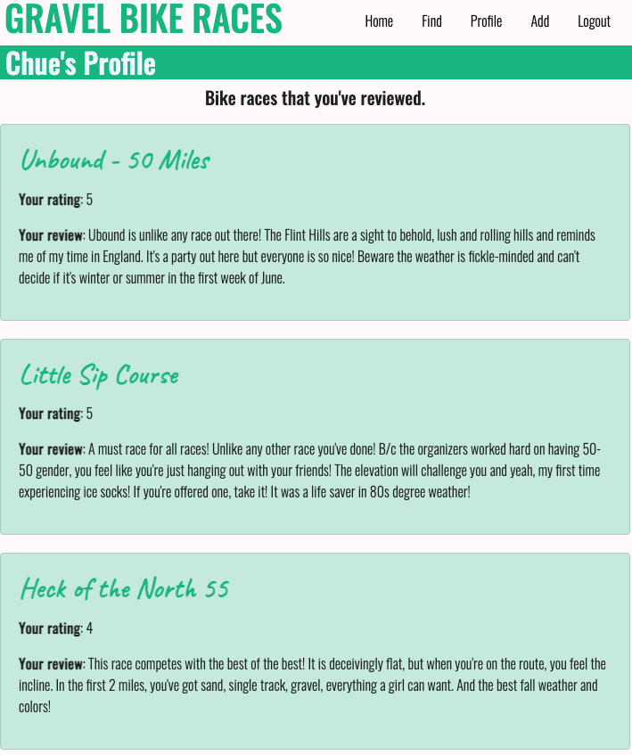
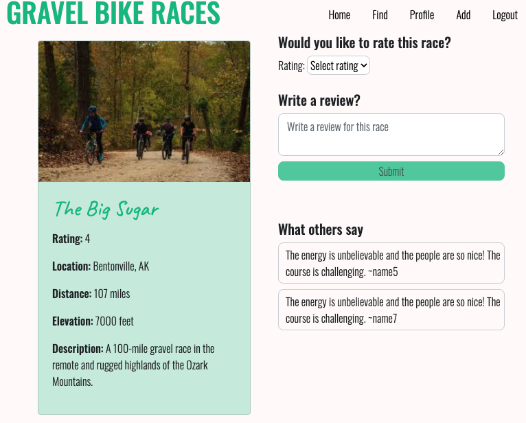

# Gravel Bike Races 

Gravel Bike Races allows users to view gravel races as pins on Google Map.   Clicking pins will show additional race information. Users can search races, create an account, add a new race, rate and review a race. Find your next gravel bike race! 

Table of Contents

## Table of Contents
* Title
* Description
* [Installation](#installation)
* [Usage](#usage)
* [Technologies Used](#technologies)
* [License](#license)
* [Contributing](#contributing)
* [Screenshots](#screenshots)

## Installation
After cloning this git repo, run the following commands in your terminal:
- virtualenv env
- source env/bin/activate 
- pip3 install -r requirements 
- Google API Key (see below)
- python3 seed_database.py 
- python3 server.py.  

You'll need to get a Google API key (https://developers.google.com/maps/documentation/javascript/get-api-key) to create a secrets.sh file and replace my key with your key in the server.py file. 

## Usage
Navigate to (http://3.21.21.164/) to start using this app.

## Technologies Used
- Python
- Flask
- Jinja
- JavaScript
- HTML/CSS
- PostgresSQL
- Bootstrap 5
- Google MAP API
- Google Geocode API

## License
This repository uses an open-source license. Please check the readme badges or refer to the license documentation in the repository for more information.

## Contributing

Please note that this project is released with a Contributor Code of Conduct. By participating in this project you agree to abide by its terms.

## Screenshots

